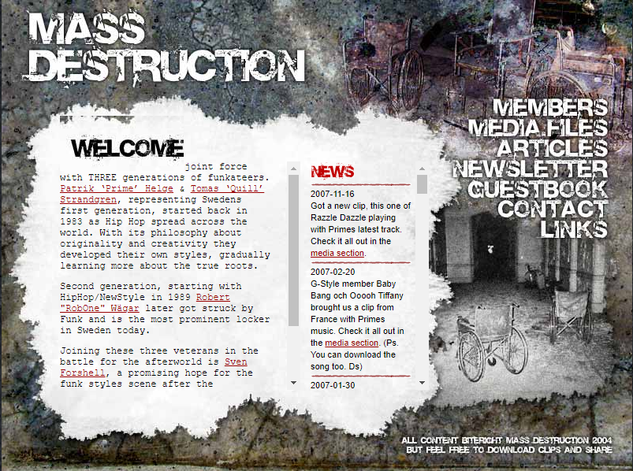

# First framework project CME

## Assignment 3 (Frameworks)

### Rebuilding of design from an old crew website

So I changed my mind, I can add some interactive to it because its a part of the assignment
I want to rebuild and old website. We had a popping crew back some 15 years ago 
our friend SLAM TILT Sven Forshell (R.I.P) created this site and did the designs back then. 
He was also the person who put the group together. 
Crew members of Massdescruction was 
Slam Tilt,
Prime,
Quill,
Rob One

I hope this project is accepted as last minute change of heart. 

## IMAGE from waybackmachine for design

 &nbsp; &nbsp;

## Demo online
Massdestruction Demo - [MD](https://massdestruction.vercel.app/)

## Tech used
- [react-js](https://beta.reactjs.org/)
- [vite-js](https://vitejs.dev/)
- [react-router-dom](https://reactrouter.com/en/main)
- [sass](https://sass-lang.com/)
- [framer-motion](https://www.framer.com/motion/)
- [date-fns](https://date-fns.org/)
- [use-interval](https://www.npmjs.com/package/use-interval)

## __My Socials__

- Github - [robonexx](https://github.com/xxrobone)
- Linkedin - [Robert Wägar](https://www.linkedin.com/in/robert-w%C3%A4gar-1b4661139/)
- Portfolio - [Portfolio](https://www.robertwagar.se) - will do a remake using react or next